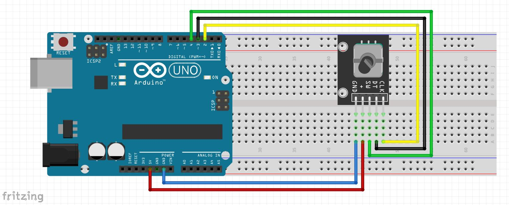

# 🔄 Arduino Rotary Encoder Test  

This project demonstrates how to use a **rotary encoder (KY-040)** with an **Arduino** to detect rotation direction and button presses. The output is displayed in the **Serial Monitor**.  

---
## 🔗 Connect with Me
[🌐 Website](https://electroiot.in)  
[✉️ Email](mailto:electroiot@hotmail.com)  
[📺 YouTube](https://www.youtube.com/@ElectroIoT-IN)  
[🔬 Hackster.io](https://www.hackster.io/Manoranjan2050)  
[📖 Instructables](https://www.instructables.com/member/ElectroIoTIN)  


## 📌 What is a Rotary Encoder?  

A **rotary encoder** is an electro-mechanical device that converts rotational motion into digital signals. It is commonly used for **volume control, navigation menus, and robotics**. The **KY-040 rotary encoder** has:  

- **CLK (Clock)** – Outputs pulses when the encoder is rotated.  
- **DT (Data)** – Determines the rotation direction.  
- **SW (Switch)** – Button press detection.  
- **VCC & GND** – Power supply connections.  

---

## 🛠 Components Required  

| Component           | Quantity |
|---------------------|----------|
| **Arduino Uno/Nano/Mega** | 1 |
| **Rotary Encoder (KY-040)** | 1 |
| **Jumper Wires**   | 5 |

---
### 🖼 Schematic Diagram  

 *(Replace with your image link)*  

---

## 📡 Connection Details  

| Rotary Encoder Pin | Arduino Pin |
|-------------------|------------|
| **CLK (Clock)**   | **D2**      |
| **DT (Data)**     | **D3**      |
| **SW (Switch)**   | **D4**      |
| **VCC**           | **5V**      |
| **GND**           | **GND**     |

---

## 💻 Code  

```cpp
// Define rotary encoder pins
#define CLK 2  // Clock pin
#define DT 3   // Data pin
#define SW 4   // Switch pin

int lastStateCLK;
int currentStateCLK;

void setup() {
    pinMode(CLK, INPUT);
    pinMode(DT, INPUT);
    pinMode(SW, INPUT_PULLUP);  // Internal pull-up resistor enabled for button

    Serial.begin(9600);
    lastStateCLK = digitalRead(CLK); // Read initial state of CLK
}

void loop() {
    currentStateCLK = digitalRead(CLK);

    // Detect rotation direction
    if (currentStateCLK != lastStateCLK) {
        if (digitalRead(DT) != currentStateCLK) {
            Serial.println("Rotated: Clockwise");
        } else {
            Serial.println("Rotated: Counterclockwise");
        }
    }
    lastStateCLK = currentStateCLK;

    // Detect button press
    if (digitalRead(SW) == LOW) {
        Serial.println("Button Pressed");
        delay(200); // Debounce delay
    }
}
